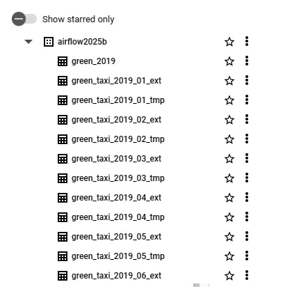
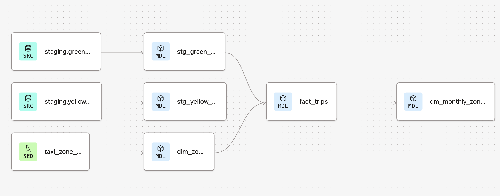
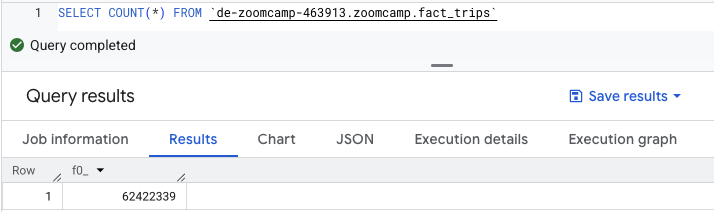
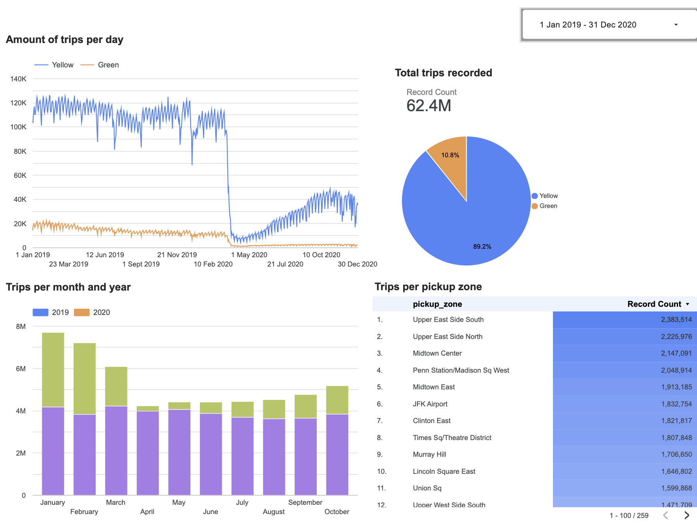

# Introduction
This is a project which takes data from the GitHub archived [NYC Trip Data](https://github.com/DataTalksClub/nyc-tlc-data) and transforms it in order to visualize the monthly trip trends by zone and service type.

# Dataset
The NYC Trip Data public dataset is a collection of detailed taxi trip records from New York City, published by the NYC Taxi and Limousine Commission (TLC). It includes data from yellow taxis, green taxis, and other services like for-hire vehicles (FHV). This project focuses on the yellow and green trip data in year 2019 and 2020.
- Yellow taxis are the iconic NYC cabs that can pick up street hails in all five boroughs, but they primarily operate in Manhattan.
  - Fields include:
    - `tpep_pickup_datetime` and `tpep_dropoff_datetime`: timestamp of trip start and end.
    - `passenger_count`: number of passengers.
    - `trip_distance`: distance of the trip in miles.
    - `PULocationID` and `DOLocationID`: pickup and dropoff location IDs (linked to Taxi Zone shapefiles).
    - `fare_amount`, `tip_amount`, `total_amount`: various fare metrics.
    - `payment_type`: how the trip was paid (e.g., cash, card).

- Green taxis, also called Boro Taxis. They are allowed to pick up street hails only in the outer boroughs and upper Manhattan, but they can drop off anywhere.
  - **Fields are very similar to yellow taxi data**, with some differences in:
    - Pickup/dropoff time fields: named `lpep_pickup_datetime` and `lpep_dropoff_datetime` (`lpep` stands for "livery pickup").
    - Fewer trips than yellow taxis, mostly outer borough service.

Besides, the taxi_zone_lookup.csv data is used as a master data table containing all the zone information where the taxis operate. 

# Steps of the project
## Create a Google Cloud Project
1. Create a new project in the [Google Cloud dashboard](https://console.cloud.google.com/welcome/new?inv=1&invt=Ab2CdA&project=de-zoomcamp-463913&authuser=2)
2. Create a service account with the following roles:
- `BigQuery Admin`
- `Storage Admin`
- `Storage Object Admin`
- `Viewer` 
3. Download the service account credentials file

## Ingest data to GCP

### Set up Airflow with Docker

1. Create a new sub-directory called airflow
2. Inside the airflow create dags fold to contain the DAG python files. Also create google and logs fold for future use
3. Create a Dockerfile to build the Docker image for Apache Airflow

### Connect Airflow with GCP

1. from the Airflow UI, add connections via gcp credentials.

3. the DAG will:

- Download and unzip one file for each month
- Convert into parquet
- Upload it to GCS (bucket)
- Create the final table with a given schema in BigQuery
- Create a external table referencing the raw data in GCS in BigQuery
- Create a temporary native table in BigQuery for a given month by reading from the external table created earlier. Also adds two columns a unique unique_row_id for each record by hashing certain fields, and stores the file name for reference.
- Update the final table with data from the temporary table

4. Unpause the DAG in Airflow UI

5. Once the DAG finishes, the tables can be viewed in BigQuery.

## Transformation with dbt 

### Set up dbt Cloud 

1. Create a [dbt Cloud account](https://www.getdbt.com/)
2. Set up dbt with bigquery via the service account credentials JOSN file
3. Set up a repository, select git clone and paste the SSH from my repo 
4. Create a new branch `dbt`

### Development of dbt models

#### 🟢 Sources 

These are the raw data tables that pull from:

- `staging.green_tripdata`
- `staging.yellow_tripdata`

These come from the external BigQuery datasets and are declared using `source()` in dbt.

#### 🔵 Staging Models

These models clean and standardize the raw sources:

- `stg_green_tripdata`
- `stg_yellow_tripdata`

They:

- Cast data types
- Rename columns
- Remove duplicates
- Add derived fields  `payment_type_description`

#### 🟢 Seed

- `taxi_zone_lookup`

This is a static CSV file (under `seeds/`) loaded into the warehouse using `dbt seed`.
It provides dimension info: borough, zone, service zone.

#### 🔷 Dimension Models

- `dim_zones`

It transforms the raw seed data (`taxi_zone_lookup`) to exclude unknown zones and standardize fields.

Used for joins in fact models to help enforce data integrity.

#### 🔷 Fact Model

- `fact_trips`

It combines green and yellow trip data and joins zone info to each trip.

This is the **core transactional table** that analytics will be built on.

#### 🔷 Data Mart

- `dm_monthly_zone_revenue`

It aggregates trip data by:

- `pickup_zone`
- `month`
- `service_type`

This model is **optimized for reporting** (e.g. dashboard metrics).

## Test and Build Models 

By default, only 100 rows are processed in the query for testing purposes with the control of `is_test_run` variable in staging models.

If there are not any warnings affect the procedures, transform all the data with `dbt build --select +fact_trips.sql+ --vars '{is_test_run: false}'`

Finally, we will get 62 milion rows of data.

**Further actions with dbt:**

After having this whole project, it can be took it into production, analyze the data, and serve it to our stakeholders with the following steps:

- Create new environment- *Production*
- Create a new job with `dbt run` command and schedule it in *Trigger* section

Another important feature we can implement is creating a continuous integration (CI) job. This job is triggered by pull requests and helps prevent breaking production.

# Dashboard

The last step is visualizing the ready-to-use data.

- Open Looker Studio
- Create a BigQuery data source, choosing fact_trips table
- Finally, create a time-series table, a scorecard, a piechart, a stacked column chart and a heat map. 

📊 [Explore the NYC Trip Data Dashboard](https://lookerstudio.google.com/s/r76CfMUm16A)

